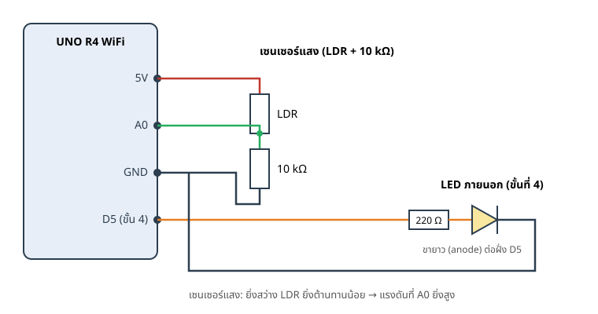

โค้ดทั้งหมดของหน้านี้อยู่ในโฟลเดอร์ `devices/` เปิดด้วย Arduino Cloud Editor หรือ Arduino IDE 2 แล้วเลือกบอร์ด **Arduino UNO R4 WiFi** ถ้าใช้ Cloud Editor ครั้งแรก ให้ทำตาม[เตรียมเครื่องมือ](arduino_cloud_editor.qmd)ก่อน (ต้องติดตั้ง Arduino Cloud Agent และกด Allow การเชื่อมต่อของเบราว์เซอร์)

::: {.callout-tip}
## ไม่มีบอร์ด?
ใช้ Wokwi จำลอง Arduino Uno ในเบราว์เซอร์ได้ ดู[ไม่มีบอร์ด? ใช้ Wokwi](wokwi.qmd) (ขั้นที่ 3 จำลอง gateway ด้วย Serial)
:::

## ต่อวงจร

{#fig-wiring fig-alt="แผนผังต่อ LDR กับตัวต้านทาน 10 กิโลโอห์มเข้าขา A0 และต่อ LED พร้อมตัวต้านทาน 220 โอห์มเข้าขา D5"}

| ชิ้นส่วน | การต่อ |
| --- | --- |
| เซนเซอร์แสง (LDR) | 5V → LDR → **A0** → ตัวต้านทาน 10 kΩ → GND (จุด A0 คือจุดแบ่งแรงดัน) |
| Grove Light Sensor | VCC → 5V, GND → GND, SIG → **A0** |
| potentiometer (จำลองแสง) | ขานอกสองขา → 5V และ GND, ขากลาง → **A0** |
| LED ภายนอก (ขั้นที่ 4 เท่านั้น) | D5 → ตัวต้านทาน 220 Ω → LED (ขายาว) → ขาสั้น → GND |

::: {.callout-important}
## ให้ "ค่ามาก = สว่างมาก"
โค้ดทุกขั้นถือว่า A0 สูงเมื่อห้องสว่าง การต่อ LDR แบบด้านบนให้ผลตามนี้ ถ้าเซนเซอร์ของคุณให้ค่ากลับด้าน ให้สลับตำแหน่ง LDR กับตัวต้านทาน หรือแก้ค่า `SENSOR_DARK` / `SENSOR_BRIGHT` ในขั้นที่ 4
:::

::: {.callout-note}
## ทำไมใช้ 5V
ตัวแปลง ADC ของ UNO R4 วัดแรงดันได้ในช่วง 0–5 V ถ้าต่อ potentiometer เข้า 3.3V ค่าสูงสุดที่อ่านได้จะอยู่ที่ราว 67% ของช่วงเท่านั้น เรื่องนี้เป็นตัวอย่างว่าทำไมบางครั้งต้องปรับเทียบ (calibrate) ค่าเซนเซอร์ ซึ่งจะทำในขั้นที่ 4
:::

## ขั้นที่ 1: อ่านค่าจากเซนเซอร์ {#sec-step1}

สเก็ตช์ `devices/01_read_light/01_read_light.ino` อ่านค่า analog ที่ A0 และพิมพ์ออก Serial

```{.cpp filename="devices/01_read_light/01_read_light.ino"}

```

1. อัปโหลดสเก็ตช์ แล้วเปิด **Tools → Serial Monitor** ตั้งความเร็วที่ **115200**
2. ใช้มือบังเซนเซอร์หรือหมุน potentiometer ดูค่า `light` เปลี่ยนในช่วง 0–1023
3. เปิด **Tools → Serial Plotter** จะเห็นเป็นกราฟ เพราะข้อมูลอยู่ในรูป `ชื่อ:ค่า`

บันทึกค่า**ที่มืดสุด**และ**สว่างสุด**ที่ห้องของคุณอ่านได้ เพราะจะใช้ตั้งเกณฑ์ในขั้นถัดไป

| สถานการณ์ | ค่า `light` ที่อ่านได้ |
| --- | ---: |
| บังเซนเซอร์มิด / หมุนสุดด้านมืด | |
| แสงห้องปกติ | |
| ส่องไฟโทรศัพท์ / หมุนสุดด้านสว่าง | |

## ขั้นที่ 2: ไฟกลางคืนที่ทำงานบนบอร์ด {#sec-step2}

ยังไม่ต้องใช้ Wi-Fi: บอร์ดเทียบค่ากับเกณฑ์แล้วสั่ง LED บนบอร์ดเอง

```{.cpp filename="devices/02_local_nightlight/02_local_nightlight.ino"}

```

สิ่งที่ควรสังเกต

- `raw < ON_BELOW` คือกฎของระบบทั้งหมด: มืดกว่าเกณฑ์ → ติด
- `358` มาจาก 35% ของ 1023 (1023 × 0.35 ≈ 358) ลองเปลี่ยนเป็นค่าจากตารางของคุณ
- `digitalWrite(LED_PIN, HIGH/LOW)` คือแอคชูเอเตอร์แบบ digital ดู[แนวคิด](01_sensors_actuators.qmd)

::: {.callout-tip}
## ลองดู: ไฟกะพริบ
ค่อย ๆ หมุน potentiometer ให้ค่าแกว่งอยู่ใกล้เกณฑ์ (ราว 358) ไฟจะติด-ดับถี่ ๆ เพราะค่าที่อ่านมีสัญญาณรบกวนเล็กน้อย เก็บปรากฏการณ์นี้ไว้ เราจะแก้ในขั้นที่ 4
:::

## ขั้นที่ 3: เชื่อมกับ gateway ผ่าน Wi-Fi {#sec-step3}

ขั้นนี้บอร์ด**ไม่ตัดสินใจเองแล้ว** แต่ส่งค่าแสงไปให้ **gateway** (โปรแกรมบนคอมพิวเตอร์ของผู้สอน) ทุก 3 วินาที และทำตามคำสั่งที่ตอบกลับ ข้อดีคือเปลี่ยนโหมดจากหน้าแชตได้ (เปิดตลอด / ปิดตลอด / อัตโนมัติ) โดยไม่ต้องแก้โค้ดบนบอร์ด

::: {.callout-note}
ฝั่ง gateway ผู้สอนเตรียมไว้ให้แล้ว คุณไม่ต้องติดตั้งหรือเปิดอะไรบนคอมพิวเตอร์ของคุณ แค่ขอ **ชื่อ/รหัส Wi-Fi** และ **`DEVICE_ID` ของคุณ** จากผู้สอน
:::

```{mermaid}
sequenceDiagram
    participant B as UNO R4 WiFi
    participant G as gateway
    participant C as หน้าแชต
    C->>G: "เปิดไฟ" (โหมด on)
    loop ทุก 3 วินาที
        B->>G: POST /v1/decisions {light_raw: 640}
        G-->>B: {action: LED_ON, mode: on, reason: ผู้ใช้สั่งเปิดไฟ}
        B->>B: ตั้ง LED ตาม action
    end
```

### เตรียมไฟล์รหัส Wi-Fi

- **Arduino IDE 2:** คัดลอก `arduino_secrets.h.example` เป็น `arduino_secrets.h` ในโฟลเดอร์เดียวกับสเก็ตช์ แล้วใส่ชื่อและรหัส Wi-Fi (คลื่น 2.4 GHz)
- **Cloud Editor:** ใส่ใน**แท็บ Secret** ของสเก็ตช์ ดูขั้นตอนที่[เตรียมเครื่องมือ](arduino_cloud_editor.qmd)
- **ห้ามนำ `arduino_secrets.h` ขึ้น GitHub** (`.gitignore` ของ repo นี้กันไว้ให้แล้ว)

### ตั้งค่าและอัปโหลด

1. ติดตั้งไลบรารี **ArduinoJson** เวอร์ชัน 7 จาก Library Manager
2. เปิด `devices/03_smart_lamp/03_smart_lamp.ino` แก้ `DEVICE_ID` ให้ไม่ซ้ำกับเพื่อน เช่น `desk-01` ถึง `desk-20` (ห้ามใช้ชื่อจริง)
3. ปล่อย `GATEWAY_HOST` เป็น `""` เพื่อให้บอร์ดค้นหา gateway เองใน Wi-Fi เดียวกัน
4. อัปโหลดสเก็ตช์ (ผู้สอนต้องเปิด gateway แล้ว)
5. Serial Monitor (115200) ควรขึ้น `Gateway found: ...` และ `HTTP 200 seq=...` ทุก 3 วินาที

### ส่วนสำคัญของโค้ด

โค้ดของขั้นนี้ยาวกว่าขั้นก่อน แต่แบ่งเป็นส่วนเล็ก ๆ ได้ดังนี้

| ฟังก์ชัน | หน้าที่ |
| --- | --- |
| `connectWiFi()` | เชื่อมต่อ Wi-Fi และรอจน DHCP ให้ IP |
| `discoverGateway()` | ส่ง UDP broadcast `AIOT_DISCOVER 1` เพื่อหา gateway ไม่ต้องใส่ IP |
| `requestDecision()` | ส่งค่าแสงด้วย HTTP POST แล้วอ่านและ**ตรวจ**คำตอบ |
| `loop()` | ทุก 3 วินาที: อ่านเซนเซอร์ → ถาม gateway → สั่ง LED |

ข้อมูลที่ส่งและรับเป็น JSON ตัวอย่างหน้าตาเป็นแบบนี้

```{.json filename="คำขอจากบอร์ด"}
{"schema_version":1,"device_id":"desk-01","seq":7,"light_raw":310}
```

```{.json filename="คำตอบจาก gateway"}
{"schema_version":1,"device_id":"desk-01","seq":7,"action":"LED_ON","mode":"auto","reason":"แสงน้อย (30% ต่ำกว่า 35%) จึงเปิดไฟ","light_pct":30}
```

::: {.callout-important}
## บอร์ดไม่เชื่อคำตอบทุกอย่าง
ก่อนเปลี่ยน LED บอร์ดตรวจ `schema_version`, `device_id`, `seq` และตรวจว่า `action` เป็นหนึ่งในสองค่าที่อนุญาตเท่านั้น (`LED_ON` / `LED_OFF`) ถ้าไม่ผ่านจะถือว่าคำตอบใช้ไม่ได้ นี่คือหลักการ **ตรวจสอบข้อมูลที่รับเข้ามา (input validation)** ที่ใช้กับทุกระบบที่รับข้อมูลจากภายนอก
:::

### เมื่อ gateway ใช้ไม่ได้: โหมด offline {#sec-offline}

ถ้าติดต่อ gateway ไม่ได้ (Wi-Fi หลุด, gateway ปิด, คำตอบผิดรูปแบบ) บอร์ดจะใช้**เกณฑ์ของตัวเอง** (`OFFLINE_ON_BELOW`) เหมือนไฟกลางคืนในขั้นที่ 2 หลอดไฟจึงยังใช้งานได้ แต่โหมดที่สั่งจากหน้าแชต (เช่น เปิดตลอด) จะหายไป จนกว่าจะเชื่อมต่อใหม่ได้ ใน Serial Monitor จะเห็น `Offline rule: ...`

ต่อไปไปที่[ใช้หน้าแชต](03_chat_ui.qmd) เพื่อสั่งโคมไฟของคุณด้วยข้อความ

## ขั้นที่ 4: ฉบับปรับแก้

สเก็ตช์ `devices/04_smart_lamp_tuned/` เป็นเวอร์ชันที่ปรับแก้แล้ว (อ่านละเอียดขึ้น เฉลี่ยค่า ปรับเทียบเซนเซอร์ fade ด้วย PWM) อธิบายที่ [ปรับแก้โค้ด](04_tuning.qmd)
